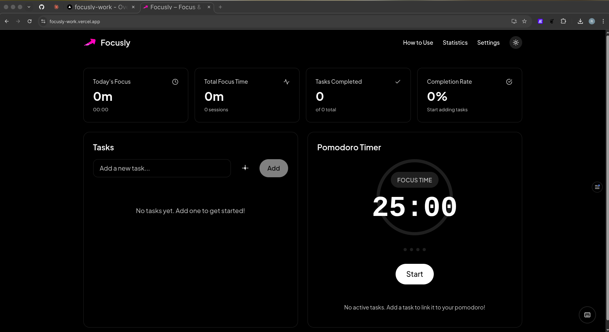
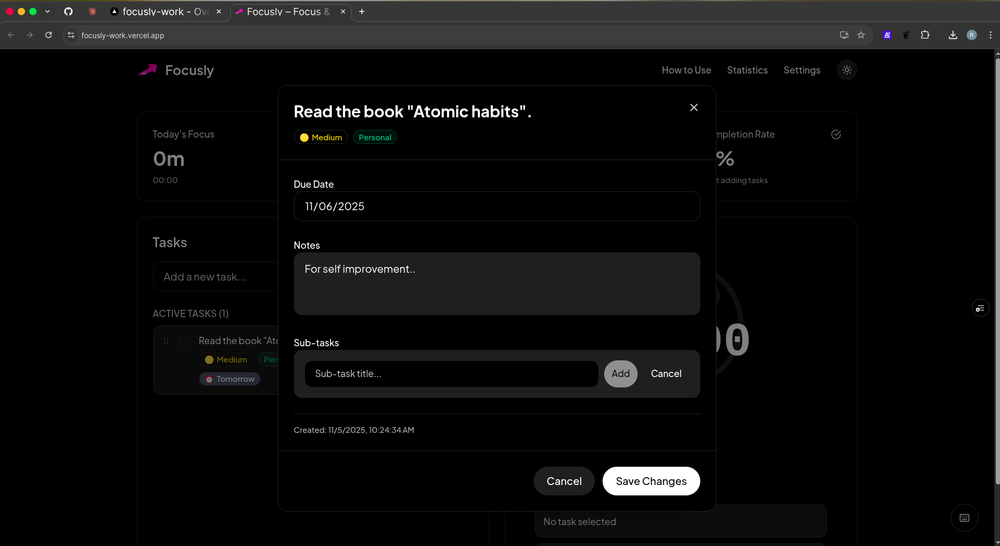
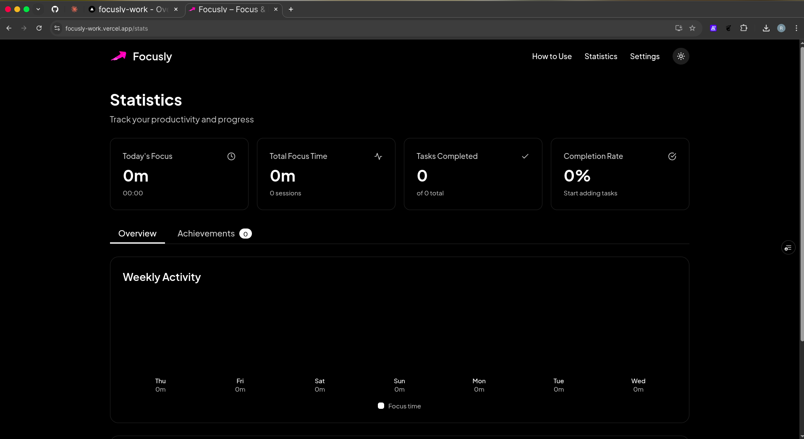
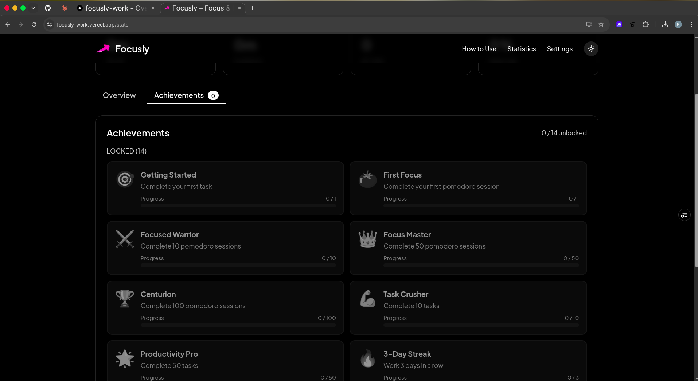

# 🎯 Focusly - Pomodoro Productivity App

A modern, feature-rich Pomodoro timer application built with Next.js, designed to help you stay focused and productive using the proven Pomodoro Technique.

## 📸 Screenshots

### Main Dashboard

*The main interface showing tasks, Pomodoro timer, and quick stats overview.*

### Task Management

*Comprehensive task management with priorities, tags, and sub-tasks.*

### Statistics & Analytics

*Detailed productivity analytics with charts and achievement tracking.*

### Settings

*Customizable timer settings and preferences.*

### Achievements

*Gamified achievement system to celebrate productivity milestones.*

## ✨ Features

### 🕒 Pomodoro Timer
- **Customizable Timer Durations**: Set your preferred work session (default 25 minutes), short break (default 5 minutes), and long break (default 15 minutes) lengths
- **Auto-start Options**: Automatically start breaks and work sessions to maintain flow
- **Session Tracking**: Visual progress ring showing current session progress
- **Cycle Management**: Automatic progression through work sessions and breaks (4 work sessions = 1 long break)

### 📋 Task Management
- **Task Creation**: Add tasks with titles, priorities, due dates, and notes
- **Priority Levels**: High, Medium, Low priority tasks with visual indicators
- **Tags**: Organize tasks with custom color-coded tags
- **Sub-tasks**: Break down complex tasks into manageable sub-tasks
- **Drag & Drop**: Reorder tasks easily with drag and drop functionality
- **Active Task Linking**: Link tasks to Pomodoro sessions for better tracking

### 🔗 Task-Pomodoro Integration
- **Active Task Selection**: Choose which task to focus on during work sessions
- **Pomodoro Counter**: Track completed Pomodoros per task
- **Visual Indicators**: Active task badges and progress tracking
- **Session History**: View which tasks were worked on during each session

### 🔔 Notifications & Sounds
- **Browser Notifications**: Get notified when sessions end (with permission)
- **Custom Sounds**: Web Audio API-generated sounds for session transitions
- **Sound Toggle**: Enable/disable sounds in settings
- **Work End & Break End**: Distinct sounds for different session types

### 📊 Statistics & Analytics
- **Comprehensive Stats**: Total focus time, completed tasks, sessions, and streaks
- **Weekly Charts**: Visual representation of productivity over the last 7 days
- **Achievement System**: Unlock achievements for milestones and streaks
- **Session History**: Detailed log of all completed sessions
- **Streak Tracking**: Daily work streaks with longest streak records

### 🏆 Achievement System
- **Gamification**: Earn achievements for productivity milestones
- **Progress Tracking**: Visual progress bars for locked achievements
- **Categories**: Tasks, Pomodoros, Streaks, Focus Time achievements
- **Notifications**: Celebrate unlocking new achievements

### ⚙️ Customizable Settings
- **Timer Configuration**: Adjust all timer durations and cycle settings
- **Auto-start Toggles**: Control automatic session starts
- **Sound Settings**: Enable/disable audio notifications
- **Reset Options**: Restore default settings anytime

### 🎨 User Experience
- **Dark/Light Mode**: Toggle between themes with system preference detection
- **Responsive Design**: Works seamlessly on desktop and mobile devices
- **Keyboard Shortcuts**: Power user shortcuts for common actions
- **PWA Ready**: Install as a web app on supported devices

### ⌨️ Keyboard Shortcuts
- **Space**: Start/Pause timer
- **S**: Skip to next session
- **R**: Reset current session
- **N**: Create new task
- **Shift + ?**: Show shortcuts modal
- **Navigation**: Quick access to different pages

## 🚀 Getting Started

### Prerequisites
- Node.js 18+
- npm or yarn

### Installation

1. **Clone the repository**
   ```bash
   git clone <repository-url>
   cd focusly
   ```

2. **Install dependencies**
   ```bash
   npm install
   ```

3. **Run the development server**
   ```bash
   npm run dev
   ```

4. **Open your browser**
   Navigate to [http://localhost:3000](http://localhost:3000)

### Build for Production

```bash
npm run build
npm start
```

## 📖 How to Use

### Basic Workflow
1. **Create Tasks**: Add tasks you want to work on with priorities and due dates
2. **Set Active Task**: Click "Set Active" on a task to link it to your Pomodoro sessions
3. **Start Timer**: Begin a 25-minute focus session
4. **Take Breaks**: Short breaks (5 min) after each work session, long breaks (15 min) after 4 cycles
5. **Track Progress**: Monitor your productivity with detailed statistics and achievements

### Advanced Features
- **Tag Management**: Create custom tags to categorize your tasks
- **Sub-task Breakdown**: Split large tasks into smaller, actionable items
- **Custom Timer Settings**: Adjust durations to match your preferred work rhythm
- **Achievement Hunting**: Work towards unlocking all productivity achievements

## 🛠️ Tech Stack

- **Framework**: Next.js 14+ with App Router
- **Styling**: Tailwind CSS
- **State Management**: React Hooks + localStorage
- **Charts**: Custom SVG-based productivity charts
- **Audio**: Web Audio API for sound generation
- **PWA**: Service Worker ready for offline functionality

## 📁 Project Structure

```
focusly/
├── src/
│   ├── app/                 # Next.js app router pages
│   │   ├── page.tsx        # Home page
│   │   ├── settings/       # Settings page
│   │   ├── stats/          # Statistics page
│   │   └── how-to-use/     # Guide page
│   ├── components/         # React components
│   │   ├── pomodoro/       # Timer components
│   │   ├── tasks/          # Task management
│   │   ├── stats/          # Statistics display
│   │   ├── settings/       # Settings interface
│   │   ├── achievements/   # Achievement system
│   │   └── ui/             # Reusable UI components
│   ├── lib/
│   │   ├── hooks/          # Custom React hooks
│   │   └── utils/          # Utility functions
│   └── types/              # TypeScript type definitions
├── public/                 # Static assets
└── README.md
```

## 🎯 Pomodoro Technique

Focusly implements the classic Pomodoro Technique:
- **Work Session**: 25 minutes of focused work
- **Short Break**: 5 minutes between work sessions
- **Long Break**: 15 minutes after 4 work sessions
- **Cycle**: Repeat the pattern continuously

The technique helps maintain concentration while preventing burnout through regular breaks.

## 🤝 Contributing

1. Fork the repository
2. Create a feature branch (`git checkout -b feature/amazing-feature`)
3. Commit your changes (`git commit -m 'Add amazing feature'`)
4. Push to the branch (`git push origin feature/amazing-feature`)
5. Open a Pull Request

## 📄 License

This project is open source and available under the [MIT License](LICENSE).

## 🙏 Acknowledgments

- Inspired by the Pomodoro Technique® created by Francesco Cirillo
- Built with modern web technologies for optimal performance
- Designed for productivity enthusiasts worldwide

---

**🎉 Stay focused and productive with Focusly! 🍅**